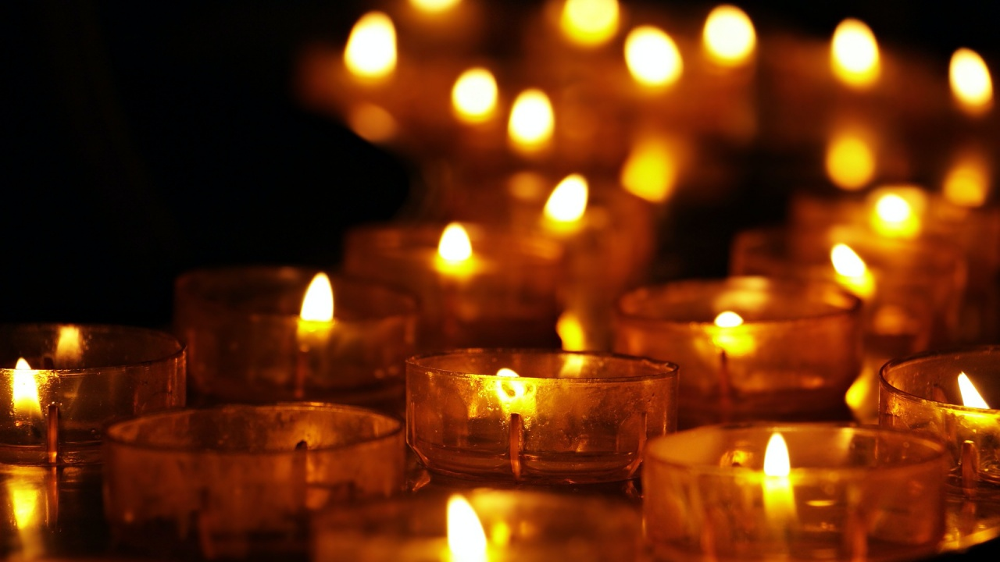

目まぐるしく過ぎていく日々に疲れた。

そんな悩みを抱えてる方は多いのではないでしょうか？

本記事では、幸せな暮らしを送りたい方のために、北欧デンマークの暮らしに根付くヒュッゲ（HYGGE）という考え方を紹介します。

## ヒュッゲ（HYGGE）とは？

ヒュッゲ（HYGGE）とは、デンマーク語で「居心地の良い空間」「満ち足りてる時間」「不安がない状態」のことを言います。

明確に存在するものではなく、その場の空気感や経験をあらわす言葉です。

- 大好きな人との食事やおしゃべり
- 愛犬・愛猫と窓ぎわで日向ぼっこ
- 家に帰ってきたときのほっとする瞬間
- 毛布にくるまってウトウトしてる時間

この些細で安心できることすべてがヒュッゲです。

日本語に直訳できないのですが「のんびり」「ほっこり」「チル」「ていねいな暮らし」といったイメージでしょうか。

## ヒュッゲの使い方

ヒュッゲは動詞でもあり形容詞でもあります。動詞で使うときには「今日ヒュッゲしない？」、形容詞では「ヒュッゲらしい」「ヒュッゲ的だね」こんなふうに使われます。

ヒュッゲの語源はノルウェー語で、デンマークの書物に登場したのはなんと1800年代初めのこと！

200年の時を超えて、デンマークではヒュッゲが日々の会話やライフスタイルに深く溶け込み、文化であり、アイデンティティとなっています。

### フィーカ・ラーゴムとの違い

ヒュッゲと混同される言葉として「フィーカ」と「ラーゴム」があります。

フィーカもラーゴムも、デンマーク語ではなくスウェーデン語です。

フィーカ（Fika）とは、甘いものを食べながらコーヒーを飲む習慣のこと。

スウェーデン人はほぼ全員、1日にフィーカの時間を数回とると言われるほど、同国に深く根付いた文化です。

対してラーゴム（Lagom）とは「ほどほど」「ちょうどいい」という意味の言葉です。

多すぎず少なすぎず、欲張らずケチらない。

ラーゴムは、スウェーデン人が生活をする上でとても大切にしている考え方です。

デンマークとスウェーデンはもともと1つの王国だったので、どちらもヒュッゲの考え方に通ずる部分があると思います。

## 北欧デンマークは世界一幸せな国

デンマークは国連が発表している「世界でもっとも幸せな国」ランキングで常に上位にランクインしている国です。

これは国民全員が居心地の良さや温かみといったヒュッゲの感覚を持ち合わせているからだと考えられます。

実際に、世界幸福度ランキングの調査結果をくわしく見てみましょう。

この調査は、150以上の国や地域を対象として自分の幸福度が0から10のどの段階にあるかを答えるものです。判断基準には以下のような項目があります。

- 国民1人あたりのGDP
- 社会的支援（困ったときに頼ることができる家族や仲間がいるか）
- 人生の選択の自由度
- 健康寿命
- 寛容さ（過去1ヶ月の間にチャリティー等に寄付をしたことがあるかなど）
- 信頼（不満、悲しみ、怒りが多いか少ないか、企業や政府の汚職、自由度など）

この調査で日本は毎年G7の中で最下位。2017年51位、2018年54位、2019年58位、2020年62位と年々下がっています。

一方、デンマークは2017年2位、2018年4位、2019年2位、2020年2位にランクイン。2013年、2014年、2016年には1位に！

デンマークは税金が世界でもっとも高く、365日中179日は雨の国。

なんだか大変そう、生活しにくそうに思えますが、デンマーク人はなぜか幸せな人が多いです。

- 教育費が大学まで無料
- 医療もすべて無料
- 出産費無料
- 充実した高齢者サービス

デンマークは税金を高くしている代わりに、非常に充実した社会保障を整えているので「将来が不安だから貯金する」「子供の養育費のために身を粉にして働く」といった日本人にありがちな考えにはならないのかもしれません。

また、女性の社会進出や出産後の社会復帰などジェンダー平等の先進国としても有名です。

プライベートと仕事のオンオフもはっきりしており、週37時間労働を超えると罰金まであります。

このように制度が整えられているだけでなく、雨の日は家族とゆっくりすること、そもそも安全な家にいられること自体がヒュッゲだとするデンマーク人の考えがマッチして幸福度の高い国になっているのでしょう。

### 欧米でもヒュッゲブーム

日本ではあまり耳にしないヒュッゲですが、2016年ごろから世界的なブームに。

2016年度のイギリス流行語大賞候補に選ばれたり、オックスフォード辞書選出「世界の今年の言葉」の最終選考に残ったりと、欧米でもヒュッゲが注目されています。

デンマーク人のマイク・ヴァイキングが書いた「<a target="_blank" href="https://www.amazon.co.jp/gp/product/4837957838/ref=as_li_tl?ie=UTF8&camp=247&creative=1211&creativeASIN=4837957838&linkCode=as2&tag=chanmio314-22&linkId=18e8053da859a5c7e5d91c1b089715ae">THE LITTLE BOOK OF HYGGE</a>」は、イギリスやカナダ、アメリカでベストセラー。日本語でも翻訳されています。

<a href="https://hb.afl.rakuten.co.jp/hgc/1043602/yomereba_main_20210729182917201?pc=http%3A%2F%2Fbooks.rakuten.co.jp%2Frb%2F15109023%2F%3Fscid%3Daf_ich_link_urltxt%26m%3Dhttp%3A%2F%2Fm.rakuten.co.jp%2Fev%2Fbook%2F" target="_blank" >ヒュッゲ　365日「シンプルな幸せ」のつくり方</a>
posted with <a href="https://yomereba.com" rel="nofollow" target="_blank">ヨメレバ</a>

マイク・ヴァイキング/ニコライ バーグマン 三笠書房 2017年10月13日頃    

<a href="https://www.amazon.co.jp/exec/obidos/asin/4837957838/chanmio314-22/" target="_blank" >Amazonで見る</a>

<a href="https://hb.afl.rakuten.co.jp/hgc/1043602/yomereba_main_20210729182917201?pc=http%3A%2F%2Fbooks.rakuten.co.jp%2Frb%2F15109023%2F%3Fscid%3Daf_ich_link_urltxt%26m%3Dhttp%3A%2F%2Fm.rakuten.co.jp%2Fev%2Fbook%2F" target="_blank" >楽天ブックスで見る</a>
                                    	  	  	  	  	

他にもライフスタイル、インテリア、料理など複数のジャンルからヒュッゲの本が出版され、欧米人のヒュッゲへの注目はとても高まっています。

## ヒュッゲを楽しむ10のポイント

日本では「忙しい生活に追われて心の余裕がない」「情報が多すぎる」「日々のタスクをこなすだけで精いっぱい」といった方が多いのではないでしょうか。

かくいうわたしも、そんな生活に飲まれて疲れ切ってしまうことが多々あります。

そんな時こそヒュッゲの精神が役に立ちます。

むずかしいことはひとつもありません。ヒュッゲに必要な10のポイントを紹介します。

### 「今」「ここ」に集中する

ネットニュースをひらけばネガティブな情報が飛び交い、SNSをひらけばキラキラしたように見える他人の投稿。

マイナスの渦に巻き込まれて、気づけば適当な食事、睡眠の質も悪い、そんな生活になっていませんか？

不安や嫉妬に押しつぶされる前に、スマホやPCの電源を切ってデジタルデトックスするのがおすすめ。

わたしが実践してるのは、21時以降は「自分を大切にする時間」としてスマホを見ないことです。

あたたかな灯りの中で、自分のために紅茶を一杯いれて、今日あった良いことを思い出す時間にしてみてください。

それだけでヒュッゲな時間を楽しむことができます。

### 居心地の良い雰囲気をつくる

ヒュッゲには、キャンドルや照明による空間演出が欠かせません。

デンマーク人に「ヒュッゲといえば？」と聞くと、85%以上がキャンドルと答えるほど必要不可欠なものだとされています。

ヨーロッパ・キャンドル協会によると、デンマーク1人当たりのキャンドル年間消費量は6kg！世界ダントツの消費量です。

とくに秋と冬にほぼ毎日キャンドルをともす人が過半数で、まったく使わない人は4%しかいないそう。

また、デンマークには世界初の照明アーティストであるポール・ヘニングセンという偉人がいるほど、照明や灯りにも強いこだわりを持つ人が多いです。

電球のぎらつきを抑えたやわらかな光がヒュッゲだとされています。

天井に大きなランプをひとつ吊るすのではなく、小さな照明やキャンドルを部屋のあちこちに配置するとヒュッゲな空間をつくり出せます。

### 小さな幸せに感謝する

疲れていたり、自分ばっかりやっている気持ちが強くなると、今あるものが当たり前だと思ってしまいがち。

でも、日本語のありがとうを「有難う」と書くように、すべては有ることが難しい存在なのです。

- 仲間が進めておいてくれた作業
- パートナーがやってくれた食器洗い
- 毎朝、東の窓から明るく照らしてくれる太陽

ちょっとしたことに感謝して、きちんと相手に「ありがとう」を伝えてみてください。

言われた側も、言った側もあたたかくなる不思議な言葉です。

何かモノや評価を得て満足するのではなく、小さなことでも感謝する、日常の何気ない時間を愛おしく思う、そんな心のあり方がヒュッゲに近づく一歩かもしれません。

### あるもので心を満たす

Less is Moreという考えをご存知でしょうか？

「少ない方が豊かである」という意味で、日本だと「足るを知る」や「わびさび」などと解釈されることが多い概念です。

無い物ねだりには終わりがありません。

今より、もっと！もっと！と欲を出せば出すほど、心が貧しくなっていくのです。

まわりを見渡して今あるもので自分がいかに満たされているか確認してみましょう。

足るを知ることで、精神的な豊かさを手に入れ、次々にモノが欲しいという状態からも脱却できます。

### モノを大切にする

デンマーク人は家で過ごす時間が長いことからか、椅子をとても大切にするそう。

自分にとって一番リラックスできる場所となるので、妥協せず長い時間かけてじっくり選びます。

その代わり選んだ椅子はとても大切に、長く使います。気に入ったものは代々受け継いでいることも。

モノとのストーリーからもヒュッゲを感じることができます。

ぜひモノを買うときにはお気に入りのこだわり抜いたものを揃えるようにしてみてください。

モノは少ないほどひとつひとつの存在が大きくなります。

すっきりとしていながら愛着のあるものだけが際立つ家は、とてもヒュッゲな空間です。

### 自然に触れる

自然に囲まれていると気持ちがほぐれ、物ごとがすっきり見えてきます。

観葉植物を育てたり、季節の花を飾ってみたり、緑の多い公園に出かけてみたり。

きっとリラックスした心を取り戻せるでしょう。

電子機器など便利に暮らすために人間が創り上げたモノに囲まれて、時間に追われていれば、心が疲れてしまうこともあります。

人間も自然の一部。

自然と触れ合うことでほっとひと息、ヒュッゲな時間を過ごすことができます。

### 見栄を張らない・無理をしない

日本は「〜しないといけない」「〜じゃないと恥ずかしい」という呪縛が多いですよね。

これは無理をしていると同時に見栄も張っていて、素の自分がどこかにいってしまっている状態。

しかも、自分に課すだけならまだしも、他人にも同じように求めていませんか？

そんな同調圧力が日本人を疲れさせているように思います。

素の自分を見せることが、素の付き合いに繋がるという思考のデンマーク人。

日本人も、見栄をはらず時には手抜きをするくらいでいいのかもしれません。

### ワーク・ライフ・バランスを見直す

デンマーク人は、ワーク・ライフ・バランスを取ることがとても上手です。

残業はせず17時には一斉に退社。

家に帰ってわいわいとヒュッゲを楽しみます。

とは言っても、まだまだ長く働くことが良しとされている日本で、あしたから毎日ノー残業で帰る、というのは難しいものがあります。

まずはハードルの低いところから始めて、だんだん自分の働き方を見直していくのがおすすめです。

- 水曜日と金曜日はノー残業にする
- 無理して引き受けていた仕事を断る
- 仕事の途中でひと休みの時間を設ける

仕事に縛られず、常に自分は何をしたいのかを考えて生きることで、日々の幸せに気づける余裕ができるのかもしれません。

### 家族や友人との時間を大切にする

1人でもゆったりとした時間は過ごせますが、心許せる大切な人と過ごす時間こそヒュッゲの醍醐味です。

家族で食卓を囲んだり、友人を招いてホームパーティーをしたり、素の自分でいられる人たちと過ごす時間を大切にしましょう。

ホームパーティーといっても必死で家を掃除して、たいそうな料理を振る舞って、終わったときには疲れてぐったり…というようなものではありません。

料理は集合してからみんなで準備すればいいような手軽なもので、一緒にワイワイ過ごす時間に重きをおいたラフなものです。

たとえば、鍋パーティーやたこ焼きパーティー、そうめんパーティー、手巻き寿司パーティーなどです。

肩ひじ張るのはそれこそヒュッゲではないので、とにかくみんなが楽しめることで集まる機会を作ってみてください。

### 五感で味わう

日々忙しなく生きていると、情報も娯楽も食事も、とにかく消費消費で「味わう」ことを忘れがちに。

自分の五感をフル活動して、毎日を味わってみましょう。

- 甘くてほっとする味のスイーツ
- キャンドルのゆらゆらした灯り
- 風に吹かれて葉っぱがこすれる音
- よく通ってたパン屋の懐かしい香り
- 小さいころから使ってるブランケット

安心できること、居心地の良いことがヒュッゲです。

ありのままにヒュッゲを感じれば、自分の心がだんだん満たされていくのが分かるはず。

## 自分らしいヒュッゲを作ろう

本記事では、ヒュッゲとはなにか？北欧の人はなぜ幸せそうなのか？幸せに暮らす10のポイントを紹介しました。

ヒュッゲはお金もかからなければ、特定の人しかできないようなむずかしいことでもありません。

ヒュッゲを意識して生活することは、日常の小さな幸せを意識することにつながり、その姿勢こそが幸せに生きる秘訣なのかもしれません。

